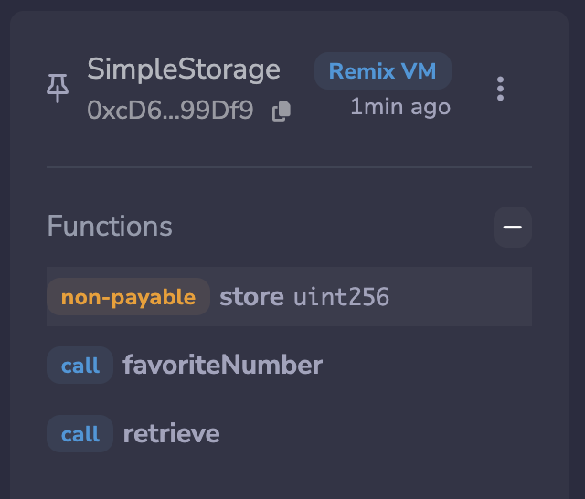

### Functions

A subsection of code that when called, will execute a very specific small piece of our entire codebase.

NOTE:

In order for us to deploy a contract, we actually have to send a transaction.

```solidity
[vm]from: 0x5B3...eddC4to: SimpleStorage.(constructor)value: 0 wei
data: 0x608...20033logs: 0hash: 0xac9...41a87

status	1 Transaction mined and execution completed
transaction hash	0xac9e67198dd9e7372f83ef47eaf94b7a8934890936d85cd0a6fb542545041a87
block hash	0xfeba0ec613954ba7ac9234ae7b2471c111fa682bd76dd109f2f3ac55020e3947
block number	1
contract address	0xd9145CCE52D386f254917e481eB44e9943F39138
from	0x5B38Da6a701c568545dCfcB03FcB875f56beddC4
to	SimpleStorage.(constructor)
transaction cost	102411 gas 
execution cost	45499 gas 
output	0x6080604052348015600f57600080fd5b506004361060285760003560e01c80636057361d14602d575b600080fd5b60436004803603810190603f91906085565b6045565b005b8060008190555050565b600080fd5b6000819050919050565b6065816054565b8114606f57600080fd5b50565b600081359050607f81605e565b92915050565b6000602082840312156098576097604f565b5b600060a4848285016072565b9150509291505056fea2646970667358221220f62593f3fe5d5ed304862d7b0f6d8fd2ecdde582d6859c2a5dc614f0cb0489a264736f6c63430008120033
decoded input	{}
decoded output	 - 
logs	[]
raw logs	[]
```

Deploying a contract uses the exact same process as sending a transaction for just ETH.

The main difference is we populate the data or input field with a ton of bytecode

NOTE: Deploying a contract is modifying the blockchain, so we do it in a transaction, which means, we spend gas.

https://docs.soliditylang.org/en/latest/contracts.html#function-visibility

Functions and Variables can have one of four different visibility specifiers in solidity:

- `public`
- `private`
- `external` and
- `internal`

NOTE: 

If you don’t give one of these keywords to your variables, it’ll get defaulted to `internal`

NOTE:

Everything on chain is technically public. So setting a function or variable to `private` isn’t a good way to hide what the value actually is there.

- Everything on these EVM chains is actually public data.

```solidity
// SPDX-License-Identifier: MIT
pragma solidity 0.8.18;  // stating our solidity version

contract SimpleStorage {
    // Basic Types: boolean, uint, int, address, bytes
    // Variables are holders for different values & these values can have one of these types

    // favoriteNumber gets initialized to 0 if no value is given

    // Adding the public keyword changes the visibility of favoriteNumber public
    // public variable means any other contract can call this favoriteNumber & 
    // see the value of what is in favoriteNumber
    uint256 public favoriteNumber; // 0

    // This function is responsible for updating our favoriteNumber. 
    // Stores a new favoriteNumber
    function store(uint256 _favoriteNumber) public {
        favoriteNumber = _favoriteNumber;
    }

    // When we add the public keyword to favoriteNumber, it is the exact same as 
    // if we created a getter function to return the favoriteNumber.
    // This function is similar to what the public keyword is creating
    function retrieve() public view returns(uint256) {
        return favoriteNumber;
    }
}
```

Scope:

Whenever you create a variable, it can only be viewed in the scope of where it is.

The easiest way to know what the scope of a variable is, is just look for the curly brackets.

When we add the `public` keyword to favoriteNumber, it is the exact same as if we created a getter function to return the favoriteNumber.

```solidity
uint256 public favoriteNumber; // 0
```

This function is similar to what the public keyword is creating:

```solidity
function retrieve() public view returns(uint256){
		return favoriteNumber;
}
```

NOTE:

Solidity has a special keyword which notates functions that don’t actually have to run or you don’t have to actually send a transaction for you to call them.

- The 2 key words are `view` and `pure`

**`view` function:**

- A function marked `view` means we are just going to read state from the blockchain.
    - Example: In our retrieve function, we’re just going to read what the favoriteNumber variable is.
    - Our `store()` function is reading, it’s updating something. It is changing the state of the blockchain, so we have to send a transaction.
    - Since our `retrieve()` function doesn’t have any code that updates anything, it just returns favoriteNumber, we don’t need to send a transaction.
    - NOTE: when you add the `view` keyword to a function, it disallows any modification of state.

**`pure` function:**

Pure functions disallow updating state and disallow reading from state and storage.

- favoriteNumber is known as a storage variable → because it is stored in a place called storage.

NOTE: When you call a view or pure function, we actually don’t need to spend gas since we’re not modifying the state.

- That’s why the buttons are blue, they are representing view or pure functions → functions we can call without having to send a transaction.



NOTE: When you cal retrieve, you do see an execution cost(gas) . Confusing right?

```solidity
[call]from: 0x5B38Da6a701c568545dCfcB03FcB875f56beddC4to: SimpleStorage.retrieve()data: 0x2e6...4cec1

from	0x5B38Da6a701c568545dCfcB03FcB875f56beddC4

to SimpleStorage.retrieve() 0x0fC5025C764cE34df352757e82f7B5c4Df39A836

execution cost	2415 gas (Cost only applies when called by a contract)

input	0x2e6...4cec1

output	0x0000000000000000000000000000000000000000000000000000000000000005

decoded input	{}

decoded output	{
	"0": "uint256: 5"
}

logs	[]

raw logs	[]
```

The reason is: if another function that does update state (that does require a transaction) calls `retrieve()`, that transaction does need to pay the gas of reading and calling this `retrieve()` function.

NOTE: So calling a `view` or `pure` function actually does cost gas, only when a gas cost transaction is calling it.

Example

```solidity
function store(uint256 _favoriteNumber) public {
    favoriteNumber = _favoriteNumber;
    retrieve();
}
```

Since `store()` costs gas, you’re telling this function, to also call the `retrieve()` function, which is more work for it to do. More work costs more gas.